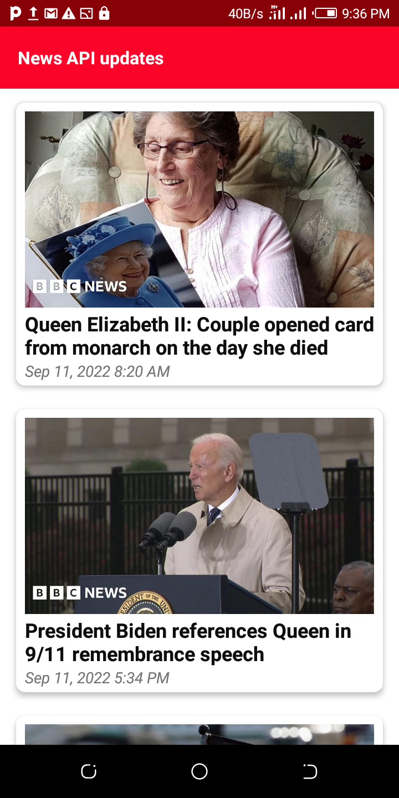
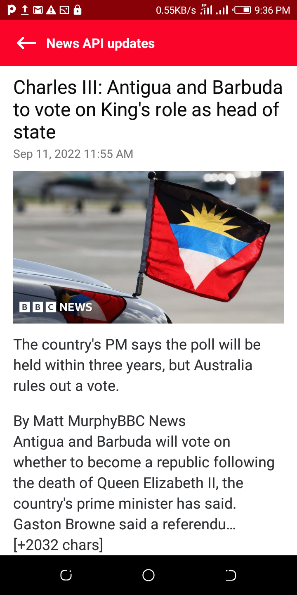

## Introduction**
CarbonAppChallenge is a fully functional Android app, written entirely in kotlin and built to consumme latest news updates from NEWS API Restful Api.

## Features

 `- Multi-module:` The application contains three modules app, app-common, app-offlinecache. the `app` module is the main application, and app-offlinecache module is the module that takes care of saving the app data for use when the device does not have network. 

 `- Offline Cache:` app-offlinecache module uses Room database for catching news article data.

## Architecture

 The `CarbonAppChallenge` app follows the MVVM design pattern for the design implementation

## Screenshots

